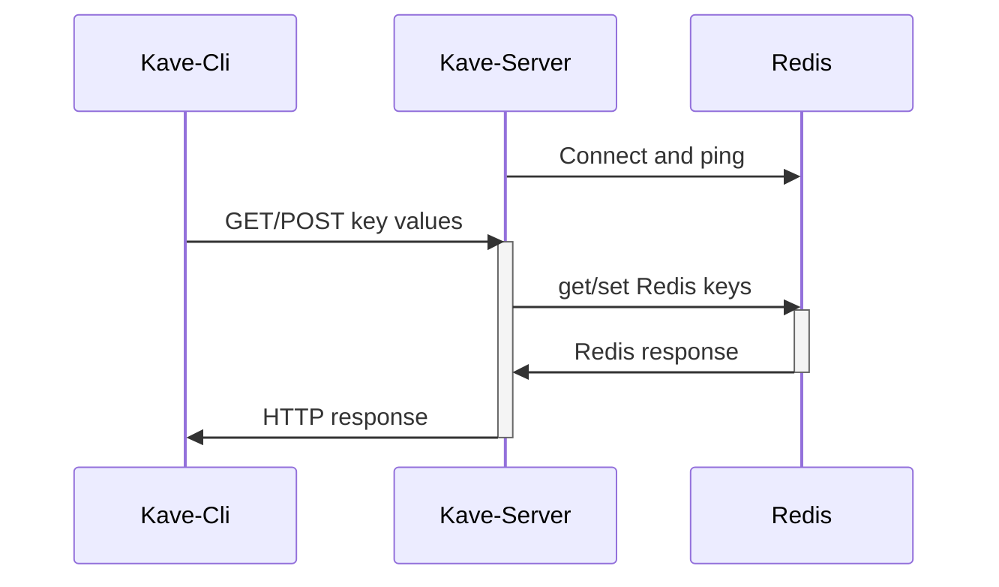

[](https://coveralls.io/github/pdcalado/kave)
[](https://goreportcard.com/report/github.com/pdcalado/kave)


# kave

Kave provides:

1. A server hosting a simple HTTP API for getting and setting key value pairs, backed by Redis.
2. A command line interface to get and set key value pairs through the HTTP API.
3. Authorization middleware with JWT validation and using scopes as permissions.
4. Token acquisition using the cli for M2M applications.

The scheme below depicts basic use of kave (auth was omitted).



## Usage

Set up your redis server and fill in a `config.toml`:

```toml
address = "localhost:8000"
redis_address = "localhost:6379"

# defaults
## Base path for routing the requests
# router_base_path = "/redis"
## Prefix on all keys for Redis requests
# redis_key_prefix = "kave:"
## HTTP incomding requests timeout in milliseconds
# timeout_ms = 2000
## Redis username
# redis_username = ""
## Redis password must be set as env variable REDIS_PASSWORD
```

(auth is also disabled by default, check [Auth](#using-auth) for details)


Run the server:

```console
> kave-server
```

Make requests using kave-cli:

```
> # initialize profile first (creates a file at $HOME/.kave/config.toml)
> # set --router_base_path if not using the default value in server
> kave init --url localhost:8000 &

> # set a key value pair
> kave set foo "bar"

> # get a key's value 
> kave get foo
bar

> # or curl if you prefer
> curl http://localhost:8000/redis/foo
bar
```

## Using auth

This auth setup requires an account in Auth0 with:

1. An API representing kave server
2. An M2M application (or more) representing the client/agents where the cli will be invoked
3. Permission scopes defined in the API and attributed to the M2M applications.

Here are some scope examples:

* `read:foo`: allows GET requests of key `kave:foo`
* `write:bar:*`: allows POST request for any key matching that pattern, such as `kave:bar:qux`

Any regexp pattern as a scope is matched against the operation (get/set) on the key. `read:` prefix allows redis get and `write:` prefix allows redis set.

**To set up auth** set in `config.toml`:

```toml
address = "localhost:8000"
redis_address = "localhost:6379"

# defaults
# router_base_path = "/redis"
# redis_key_prefix = "kave:"

[auth]
enabled = true
domain = "your-domain.eu.auth0.com"
```

Start the server as described earlier, then export some variables to use the cli:

```console
> # export your Auth0 domain
> export AUTH0_DOMAIN=your-domain.eu.auth0.com

> # export you client's secret
> export AUTH0_CLIENT_SECRET=myverypersonalsecret

> # export the audience if different the url used for `kave init`
> export AUTH0_AUDIENCE=localhost:8000

> # Grab a token first (use Auth0 client ID)
> TOKEN=$(kave token yourauth0clientid)

> # Use the cli
> kave set --token ${TOKEN} foo "bar"
> kave get --token foo
```

## Build

Clone and run:

```console
> make build
```